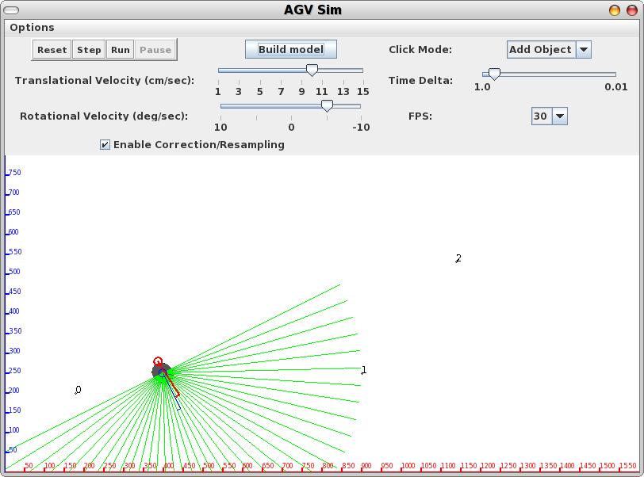
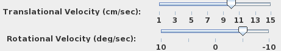
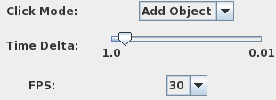
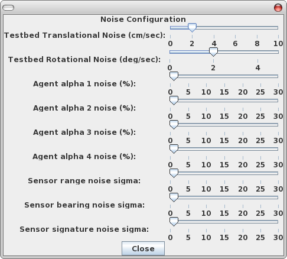
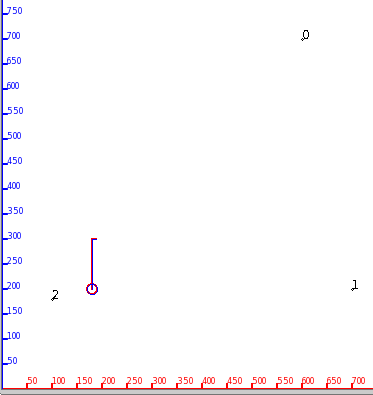
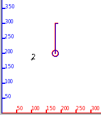
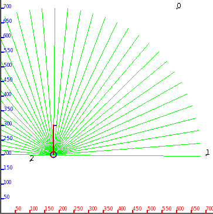
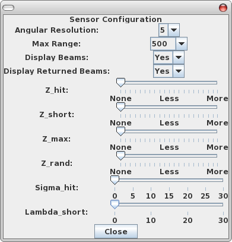

# AGV Sim

## About

Autonomous Ground Vehicle (AGV) simulator project for Computational Basis of Intelligence (CMPS 523).

## Assignment

Read the [project assignment](doc/agent_and_testbed_simulator_project.pdf) here.

## Report

Read the resulting [report](doc/report.pdf) describing the project results.

From the abstract:

_In this paper I implement a simulation testbed and agent for testing two Bayes filter algorithms, the Extended Kalman Filter (EKF) and the Particle Filter (PF). After implementing supplementary algorithms needed for motion noise, landmark detection and the like, the two algorithms are put through similar testing scenarios and the results are reported and compared. The results obtained for the test cases involving the EKF proved to be satisfactory, while the PF seemed to come up short. As it is commonly accepted that the PF is a more robust algorithm than the EKF, the author assumes that implementation errors have led to incorrect and disappointing results_
## Screenshots


  


  












  


  


## Build and Run

Most recently built and ran under Java 17.

In [src](src):

```bash
javac -cp ../Jama-1.0.2.jar *.java
```

Then:

```java
java -cp ../Jama-1.0.2.jar:. AGVsim
```
